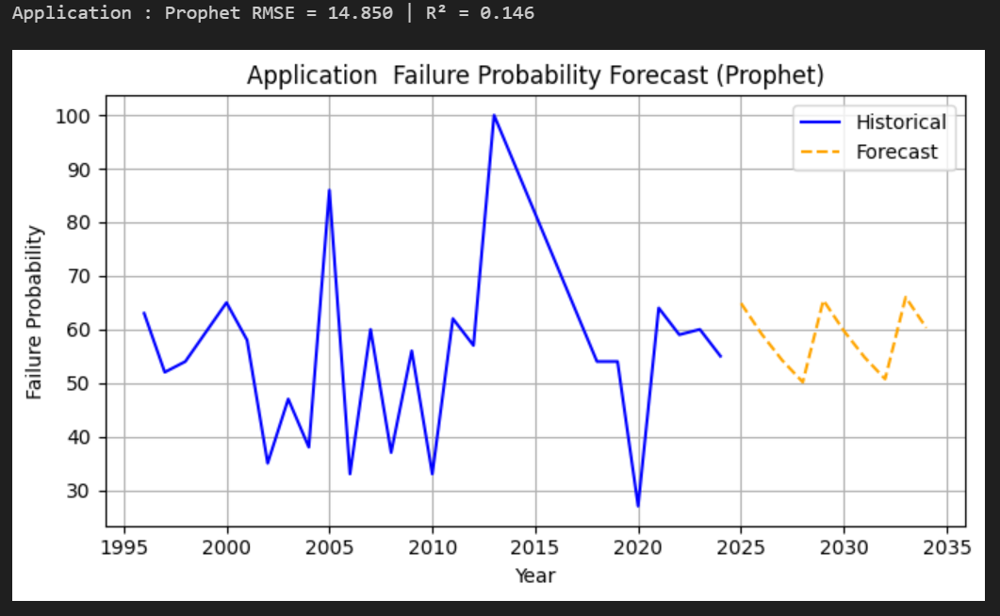

# Software Reliability Model Comparison for AIMS

This project evaluates and compares multiple machine learning and time series models to predict software failure probability in the AIMS system.

The study identifies the most accurate model for forecasting reliability across different software modules.

---

## Objectives

- Predict failure probability of AIMS software modules  
- Compare multiple models using performance metrics  
- Identify the best-performing model  
- Provide reliable forecasts for future system behavior  

---

## Models Evaluated

### Time Series Models
- ARIMA  
- Exponential Smoothing  
- Prophet (final selected model)  

### Machine Learning Models
- Linear Regression  
- Decision Tree Regressor  
- XGBoost Regressor  

---

## Methodology

### Data Preprocessing
- Cleaned dataset (`cleaned_data.csv`)  
- Handled column formatting issues  

### Train-Test Split
- Training data: ≤ 2019  
- Testing data: > 2019  

### Model Training per Module
- Application  
- Admission  
- Academic  
- Student Portal  

### Model Evaluation
- Mean Squared Error (MSE)  
- R² Score  

### Workflow
1. Train multiple models  
2. Evaluate performance on test data  
3. Compare results across all models  
4. Select best-performing model  
5. Perform final forecasting using Prophet  

---

## Evaluation Metrics

- **MSE (Mean Squared Error):** Lower values indicate better performance  
- **R² Score:** Values closer to 1 indicate better model fit  

---

## Key Findings

- Machine learning models such as Decision Tree and XGBoost showed inconsistent performance across modules  
- Classical time series models (ARIMA and Exponential Smoothing) captured trends but lacked flexibility  
- Prophet outperformed all models due to:
  - Better handling of trends  
  - Robustness to missing data  
  - Superior generalization ability  

---

## Prophet Forecast Visualizations

### Application Module Forecast

### Admission Module Forecast

### Academic Module Forecast

### Student Portal Forecast

### All Forecasted Failure Probabilities

## Conclusion

Prophet is the most suitable model for software reliability prediction in AIMS.  
It provides more accurate and consistent forecasts compared to other evaluated models.

Based on these findings, Prophet is recommended for real-world deployment to support accurate prediction of failure probabilities across different system modules or entire software systems.

---
